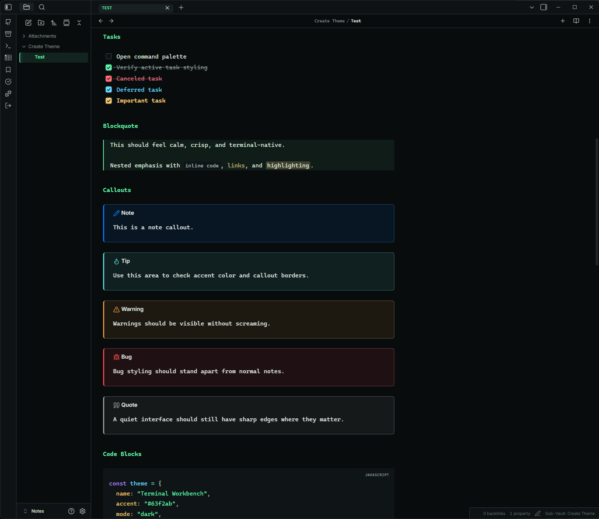

# Terminal Workbench

A modern terminal-inspired theme for [Obsidian](https://obsidian.md), built for people who spend the day in panes, shells, logs, editors, and command palettes.

The design goal is not retro green-on-black nostalgia. It is a calm, dense, high-contrast working surface: graphite backgrounds, crisp typography, restrained ANSI-style accents, readable code, and pane chrome that feels close to a modern terminal without turning your notes into a novelty skin.

**[View the live showcase](https://real-fruit-snacks.github.io/terminal-workbench/)** for both modes, the full palette, and feature details.

## Highlights

- Full dark and light modes, each a deliberate palette rather than an inversion
- A consistent "terminal manifest" idiom across the interface: monospace micro-labels for properties, code block headers, tab titles, and breadcrumbs
- Code blocks with a header band, language label, and framed styling that matches between editing and reading views
- Custom task states with distinct checkbox colors: done, cancelled, deferred, and important
- Styled Mermaid flowchart, state, sequence, and class diagrams that follow the theme palette
- Respects your Obsidian settings: accent color, interface, text, and monospace fonts, and font size all flow through
- Print-friendly: decorative elements are stripped from PDF export

## Installation

### Community themes

Once available in the community directory:

1. Open `Settings > Appearance`.
2. Under **Themes**, select **Manage**.
3. Search for `Terminal Workbench` and select **Install and use**.

### Manual

1. Create the folder `<your vault>/.obsidian/themes/Terminal Workbench/`.
2. Download `theme.css` and `manifest.json` from the [latest release](https://github.com/Real-Fruit-Snacks/terminal-workbench/releases/latest) and copy them into that folder.
3. Open Obsidian and go to `Settings > Appearance > Themes`.
4. Choose `Terminal Workbench`.

Requires Obsidian `1.5.0` or newer.

## Respecting your settings

Terminal Workbench builds on Obsidian's own settings rather than replacing them:

- The accent color follows `Settings > Appearance > Accent color` if you customize it; otherwise the theme's terminal green is used.
- Interface, text, and monospace fonts set under `Settings > Appearance` take priority over the theme's font stacks.
- Font size is controlled by the Appearance font-size slider, untouched by the theme.

## Customization

Terminal Workbench includes settings for the [Style Settings](https://github.com/mgmeyers/obsidian-style-settings) community plugin:

- Primary, secondary, and warm accent colors, configurable separately for light and dark mode
- Editor, UI, and code fonts
- Editor line width and UI corner radius
- Compact workspace mode
- Soft neon highlights
- Active-line terminal prompt marker

Suggested fonts (the theme falls back to system fonts without them):

- Editor and code: Berkeley Mono, JetBrains Mono, Cascadia Code, IBM Plex Mono
- Interface: Inter, SF Pro Text, Segoe UI

## Compatibility

The theme uses `color-mix()` for derived tints, supported by every desktop build and current mobile build that meets the minimum app version. On very old Android WebViews the theme falls back to static colors for selection, hover, and glow effects; other tints degrade gracefully.

## Development

| Path | Purpose |
|---|---|
| `theme.css` | The theme |
| `manifest.json` | Theme metadata |
| `versions.json` | Release compatibility map |
| `screenshot.png` | Community-store thumbnail |
| `docs/index.html` | Showcase page (GitHub Pages) |
| `docs/THEME-SPEC.md` | Portable design specification for reusing this visual system elsewhere |
| `.github/workflows/release.yml` | Creates a GitHub release with `manifest.json` and `theme.css` when a version tag is pushed |

To cut a release: bump `version` in `manifest.json`, add the entry to `versions.json`, then push a tag with the same version number.

## License

[MIT](LICENSE)
